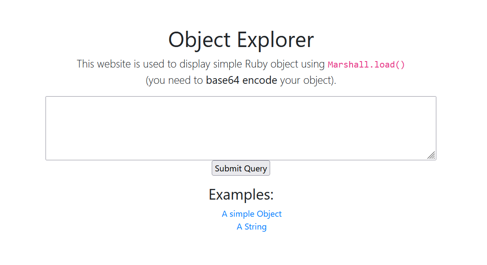

This is Deserialization function `Marshal.load`

### Chain:
When using `marshal.load` its calling to `fix_syck_default_key_in_requirements`

When `fix_syck_default_key_in_requirements` called lead to call `@requirements[0].each` meaning `OUR_CONTROLLED_OBJECT.each`

