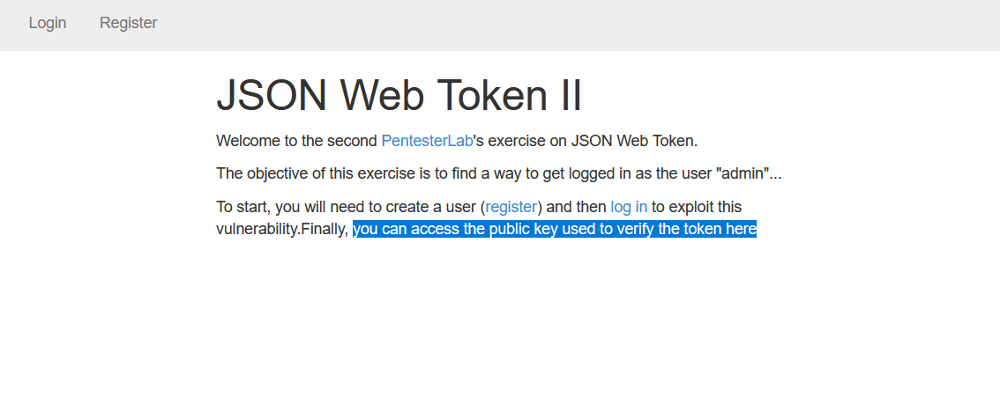
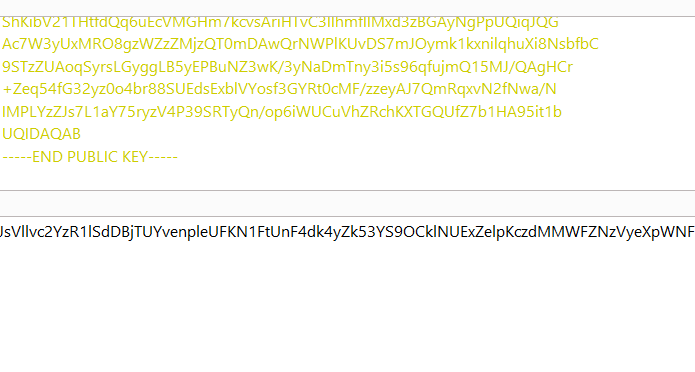
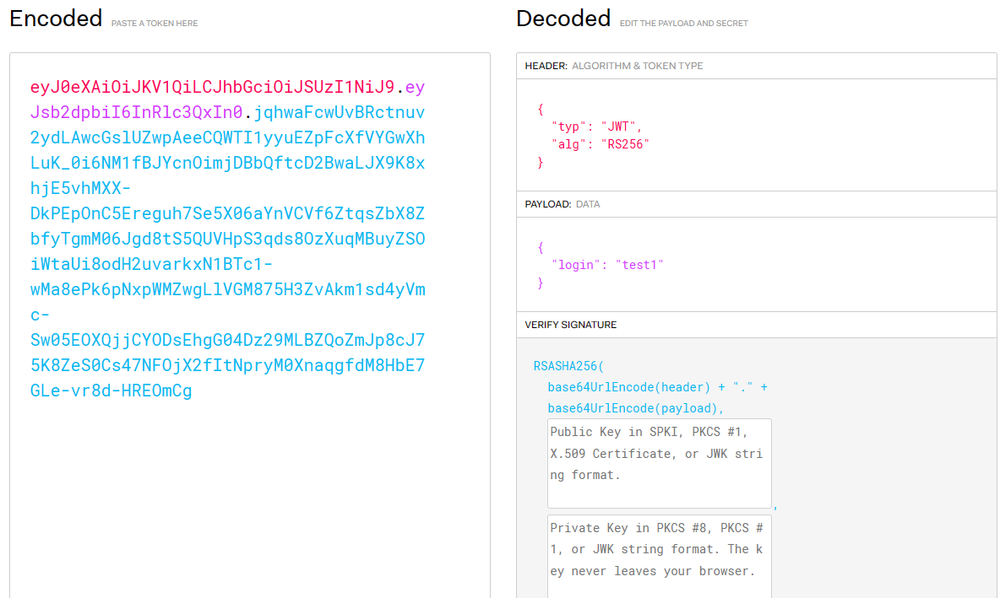
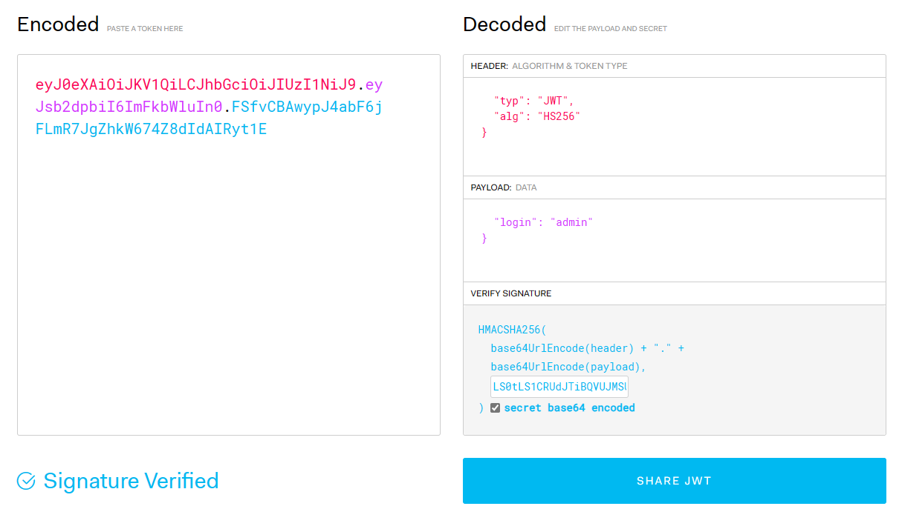
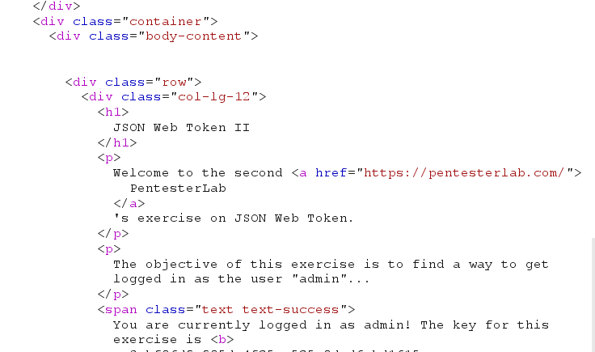

### Enumeration
Firstly, I can get public key on here

### Exploit

Copy Public key to `Decoder` burpsuite and encode this `key` by base64

Create and logon to website, copy the cookie jwt.

Paste it to jwt.io, I can see jwt decode JSON type.

The `jwt` using `RS256` to encode, I mean, I need `private key` to verify payload.

Look closely, I try change `RS256` to `HS256` it maybe work because I got `public key` and `HS256` at some CVE - The `public key` used to verify Signature `jwt`.

Give it a try,

Reminder : just tick a `secret base64 encode` 

Use this cookie, I got admin account and key to pass this chall.

