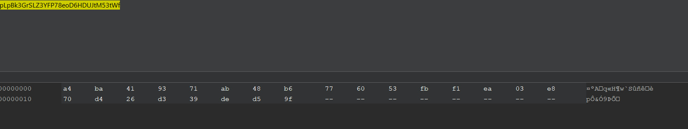
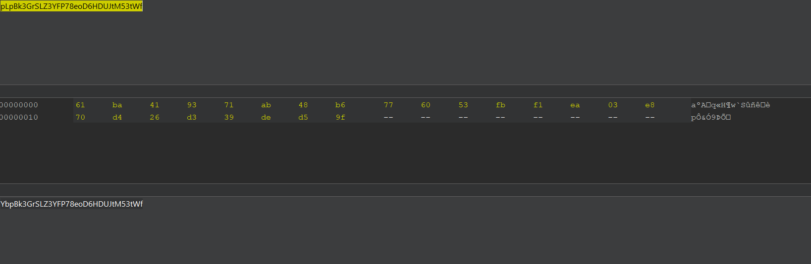
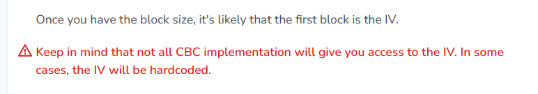
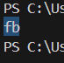
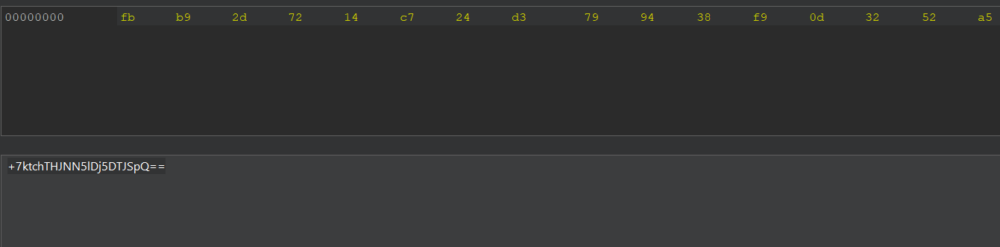
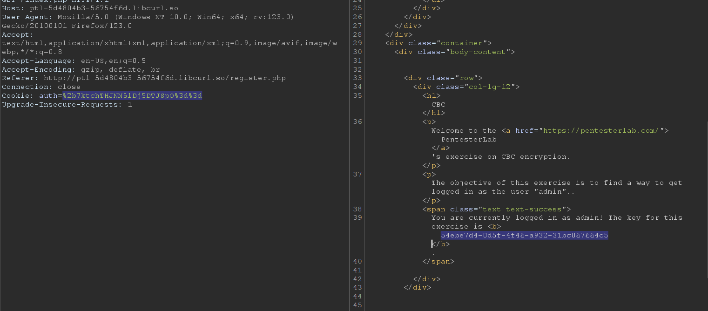

firstly i create account like `cdmin` or `ddmin` or smt like `admin`

next, i get this password, swith to decoder Burpsuite and decode it by `base64`

Got result 

try to convert `admin` to `bit`, have character `a` is `61`, try to input it and encode with `base64`

it my fail

In this lab, I fotgot 

`IV may be hardcoded`

so, i try re-login as `ddmin` account, decoded `base64` cookie  

try to brute-force first bytes of IV using `XOR` in `decrypt.py` 

encoding base64, I got re-cookie   

Complete
