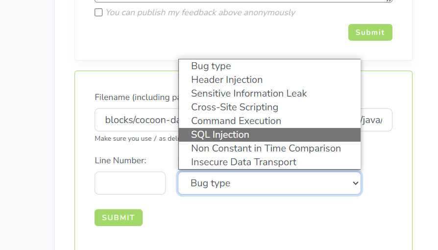
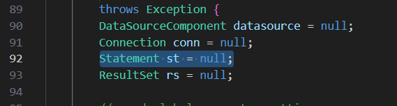

Look around this code, we have some word like `SELECT` `WHERE` or somethings related to  SQL query
so i guess it's SQL Injection

According to it, I found this code maybe not use PreparedStatement so I have grounds to confirm it is SQL injection
 

Look inside the code, on line 2xx, appear + string maybe trigger sql query when end-user enter not filtered input character
Try to submit and success

Check diff file to get some infomation