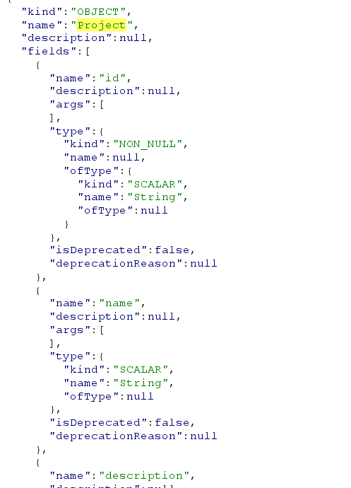
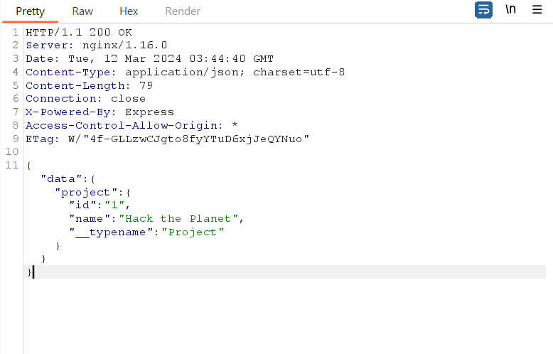
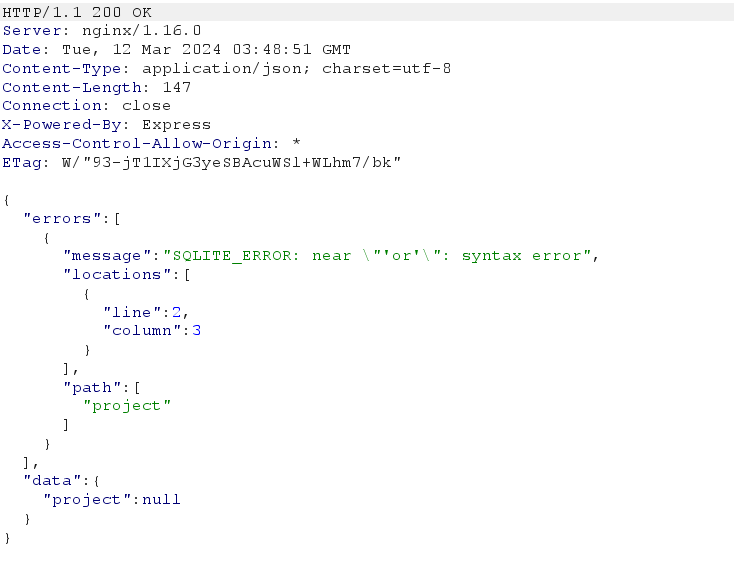
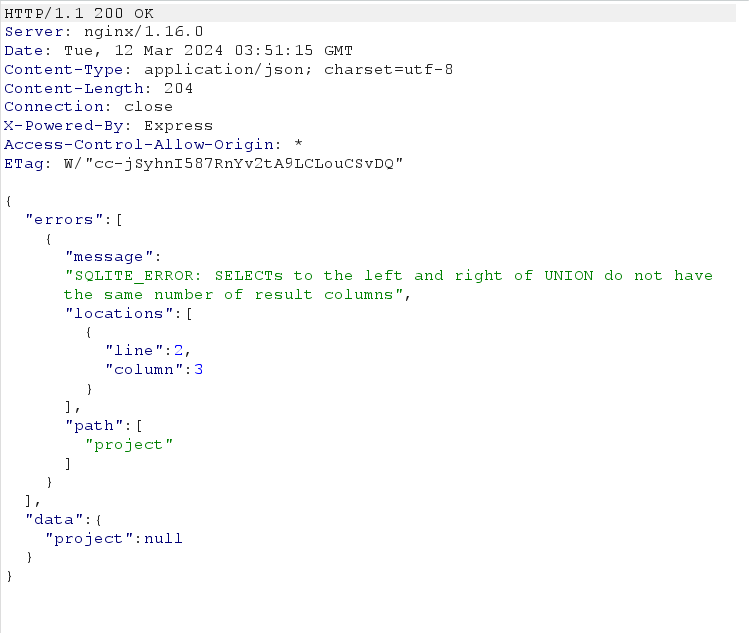
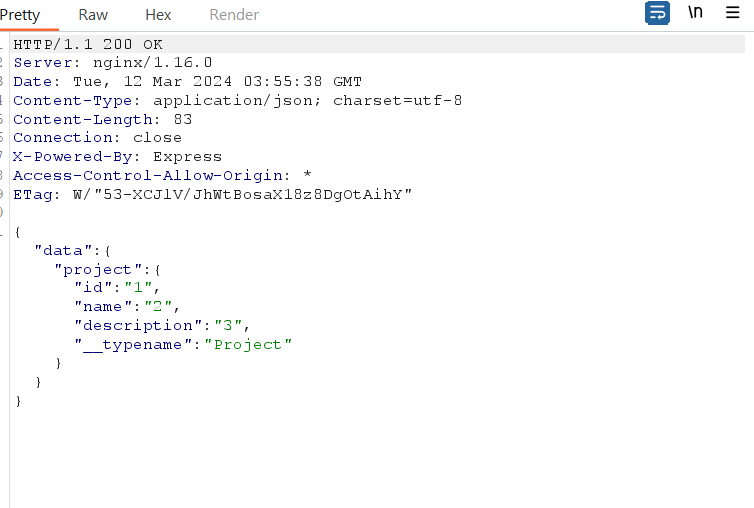
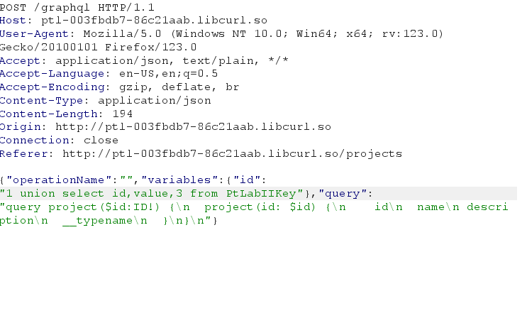
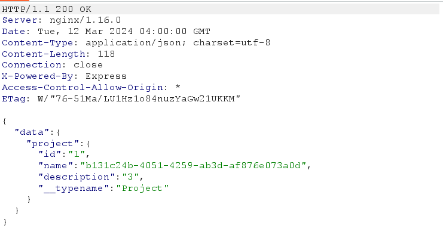

## Graphql

try using introspection query Graphql

Get schema `project` with `id,name,ofType`



let's retrieve data `project` from introspection query

modify it 

```graphql
{"operationName":"projects","variables":{"offset":10},"query":"query projects($offset: Int) {
  projects(offset: $offset, limit: 10) {
    id
    name
    description
    __typename
  }
}
"}
```

to 
```graphql
{"operationName":"project","variables":{"id":1},"query":"query project($id: ID!) {
  project(id: $id) {
    id
    name
    description
    __typename
  }
}
"}
```

I got 1 record



Insert single quotes, got sql lite error on `variables/id`



TRy to brute force column using `union` query 

using union 1,2



Not match same number colums,

continue brute force, I got right number of column query, `union select 1,2,3`, It's contain `id, name, description`



I try to get id, value from PtLabIIKey but got nothing



My mistake, id of variable is `1`, the first  condition is right, Just change it to another number - I choose `5`, Got the key

