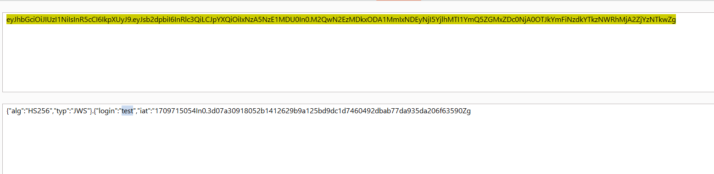
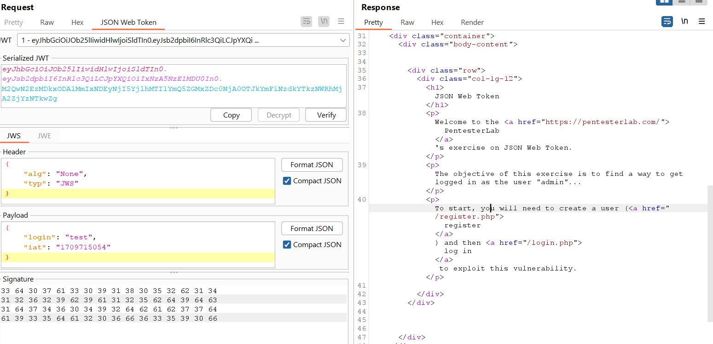
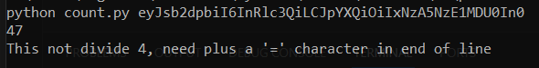
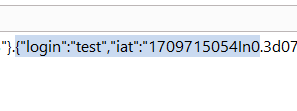
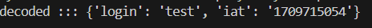
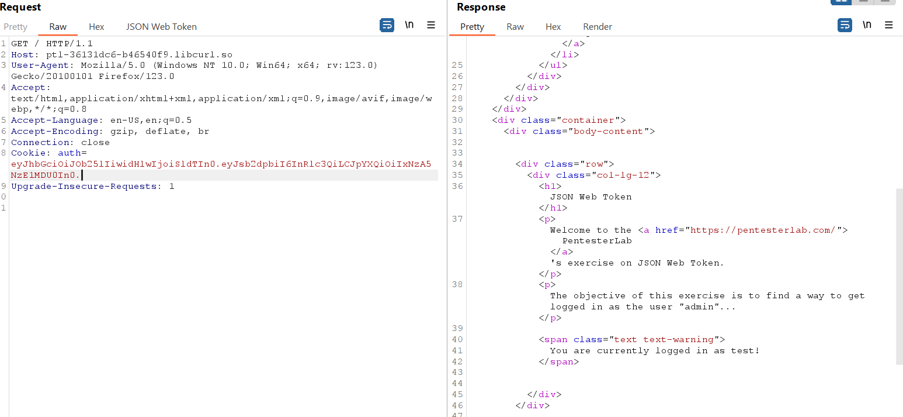
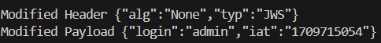
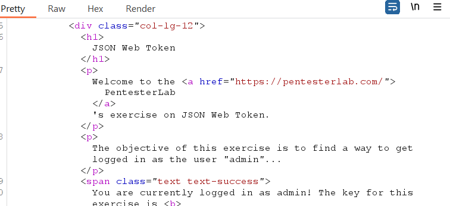

## Re-Produce

When I registered successfully, I got some information.

Website using JWT.

JWT has a base ::: base64(header).base64(body).base64(signature)

I sent it to the decoder, and they decoded it. I got my information account `test`

I dont have any private to re-sign signature

On jwt, if using algo `None`, the signature doesn't need to be verified.

Let's try to modify the `header` algo from `HS256` to `None`, encode them and sent the request.

The system will break because the server refuses my JWT authentication.

But look closely, check around `jwt body` and count some words.

Check again on `JWT decode`; the JWT cookie is not `json` type.

So, base64 on jwt, if the length of `body` jwt is divisible by 4, it automatically removes the `=` character.

Add the `=` character at the end of the string jwt `body`, and we have a complete JSON type.

Let's re-send the request. I got the `test` account successfully using `alg:None` instead of `alg:HS256` header without `Signature` jwt.

Let's modify jwt body `test` to `admin` keep the header value `alg:None` 

sent this jwt to server, of course, without signature, I got admin account and key to pass this lab.

## Reference

https://portswigger.net/web-security/jwt