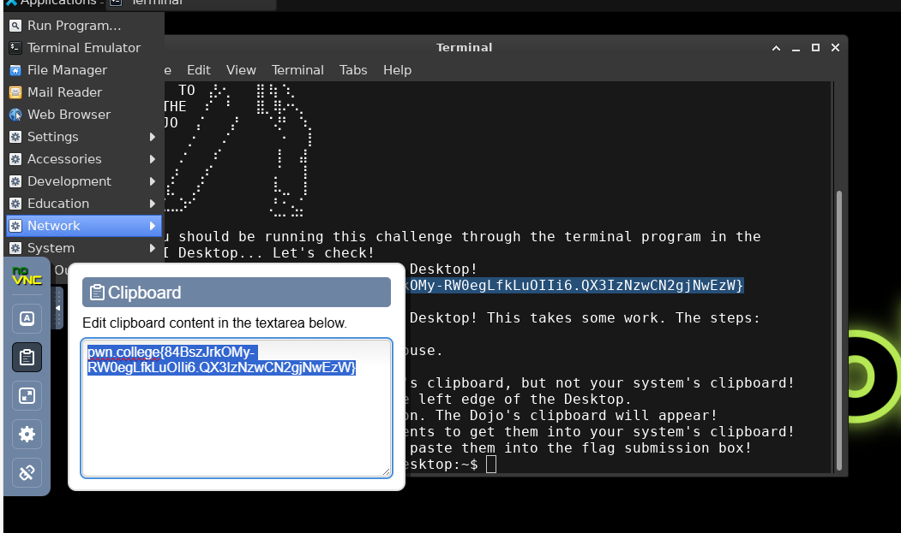

## Dojos

###  1. Using the vscode workspace

pwn.college{w0kEXEvs_w75EzPBRAVqLrqOKun.QX2IzNzwCN2gjNwEzW}

### 2. Using the gui

pwn.college{w0kEXEvs_w75EzPBRAVqLrqOKun.QX2IzNzwCN2gjNwEzW}

### 3. Pasting on desktop

pwn.college{AN8iPt6KndpL5YgC2jM2qnbnQ5p.QX4IzNzwCN2gjNwEzW}

### 4. Reset

... Nothing to do ...

## References

- [Welcome](https://pwn.college/welcome/welcome/)
