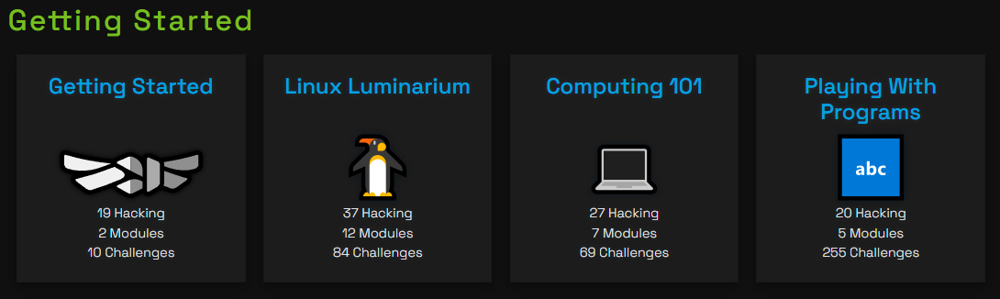

# PWN COLLEGE MAP

## Introduction

Brief introduction to the topic or problem statement.

## Dojos
### Getting Started

1. [Getting Started](/pwn.college/1_welcome/getting%20started.md)
2. [Linux Luminarium](/pwn.college/2_linux-luminarium/linux-luminarium.md)
3. [Computing 101](/pwn.college/3_computing_101/computing_101.md)
4. [Play With Programs](#)

## Results

Provide the results or findings from your analysis.

## Conclusion

Summarize the key points and conclusions.

## References

- [Link 1](#)
- [Link 2](#)

